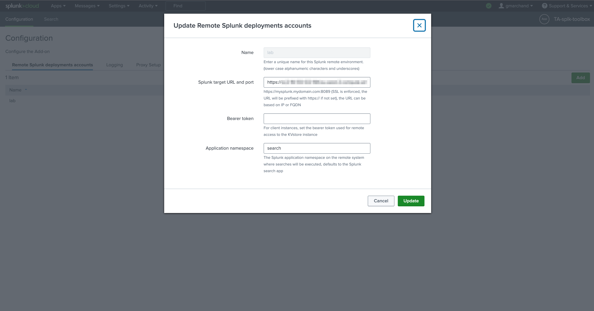
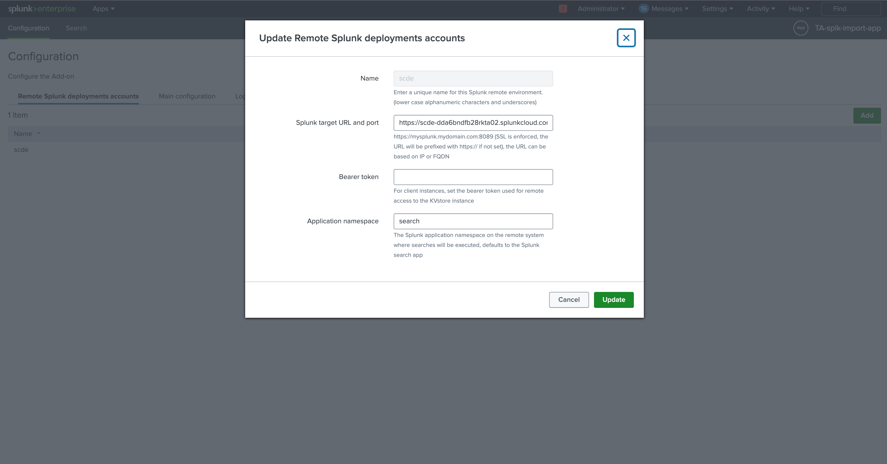
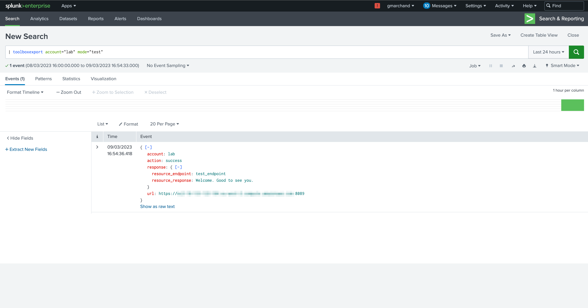
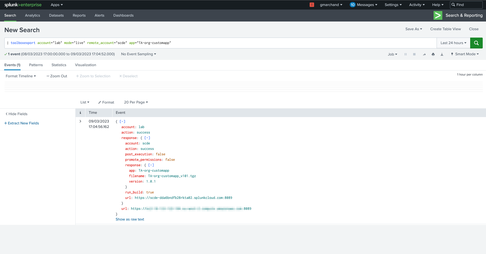
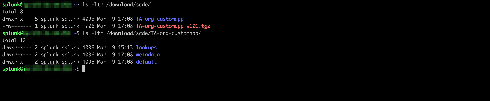
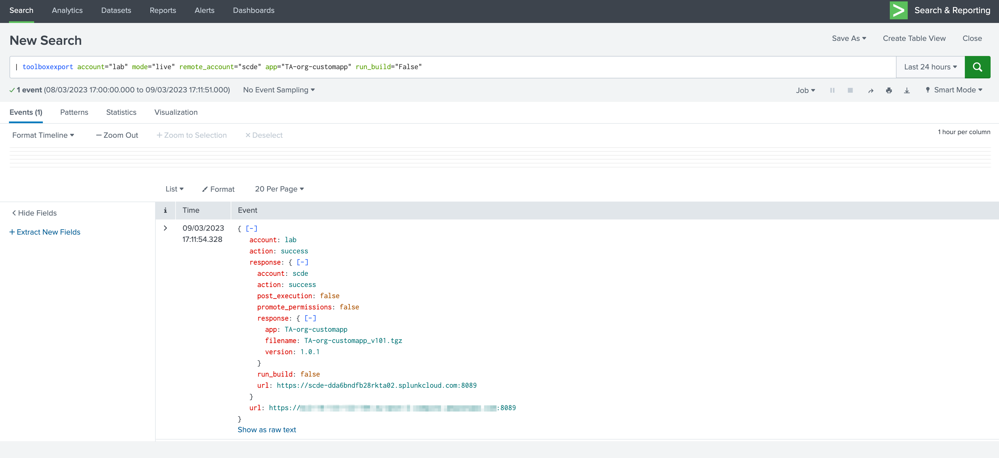
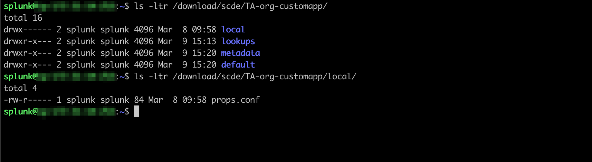
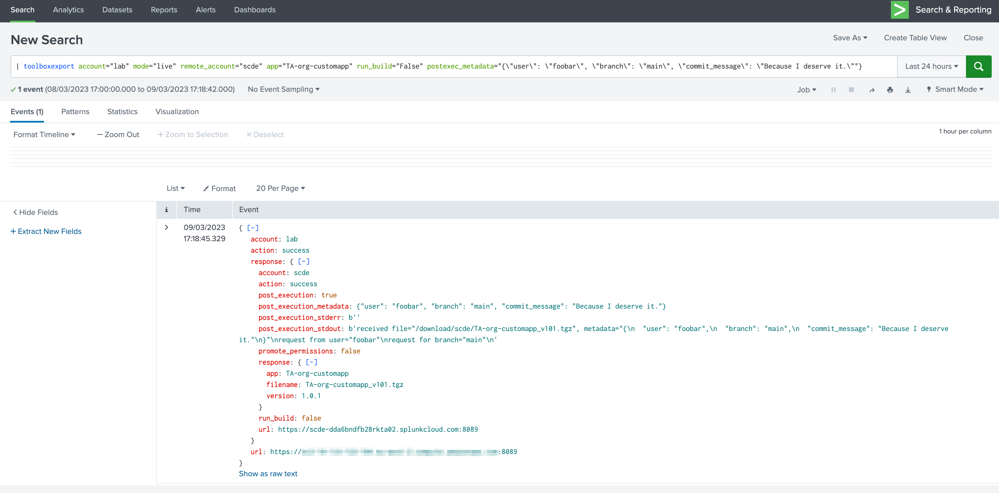

# TA-splk-toolbox - Toolbox application designed for Splunk Cloud operations

## Feature 1 - Exporting Splunk applications from Splunk Cloud

This application exposes a REST API for the purposes of exporting Splunk applications from a Splunk CLoud deployment.

### Concept

- An HTTP REST API interface exposes an endpoint that allows packaging and exporting a Splunk Application and all of its content
- Once packaged in the application working directory, the compressed tarball content is provided in a JSON payload over TLS encoded in base64
- The requester process process would read this base64 encoded JSON payload and decode the base64 using Python

### Requirements

- The only requirement is to have access to the Splunk Splunk Cloud Search Head Splunk API, which you can configure in Splunk Web
- Authentication is performed against Splunkd using valid credential you provide as part of the API requester arguments

#### Requirements for the couple TA-splk-toolbox / TA-splk-import-app

- The Splunk Cloud Search Head needs to be able to access to your Heavy Forwarder on Splunkd API 8089, for this you need to allow the outgoing traffic on ACS:

```shell
export stack="<my_stack>"
export token="<my_bearer_token>"

curl -X POST "https://admin.splunk.com/$stack/adminconfig/v2/access/outbound-ports" \
--header "Authorization: Bearer $token" \
--header 'Content-Type: application/json' \
--data-raw '{
   "outboundPorts": [{"subnets": ["<HF public IP>/32"], "port": 8089}],
   "reason": "external API splunkd"
}'
```

You can check your config as:

```shell
curl "https://admin.splunk.com/$token/adminconfig/v2/access/outbound-ports/8089" \
--header "Authorization: Bearer $token"
```

Of course, your HF needs to accept the incoming traffic from Splunk Cloud.

- Then, the Heavy Forwarder itself needs to be able to do the opposite, this means accessing Splunk Cloud Search Head API on 8089.

You can nowadays allow this traffic straight from the Splunk Cloud configuration UI.

#### Example

To export a Splunk Application and all its content in a gzip compressed tarball archived:

```shell
export login='myuser'
export pass='mypassword'
export stack='https://$mystack.splunkcloud.com:8089'
curl -k -u $muyser:"$mypassowrd" -X POST $stack/services/toolbox/v1/export/export_app -d '{"app": "Splunk_TA_juniper"}'
```

The response will be similar to:

```json
{
  "base64": "b'<encoded_base64>'",
  "app": "Splunk_TA_juniper",
  "version": "1.5.5rfb1b492",
  "filename": "Splunk_TA_juniper_v155rfb1b492.tgz",
  "result": "The package is now ready in base64."
}
```

**More details about the programmatic behaviour can be found here:**

- https://github.com/guilhemmarchand/splunk-cloud-automation/tree/main/export-apps

### Configuration parameters

#### Configuration

The App provides a configuration UI with a concept of accounts, in each account you will setup:

- An account ID
- The URL to your Splunk Heavy Forwarder API
- A bearer token for the authentication purposes

**This will target a Heavy Forwarder instance running the TA-splk-import-app which contains the mirrored API endpoint and will perform the import from Splunk Cloud:**



**The workflow is the following:**

- From Splunk Cloud, a custom command is called to trigger the import on the target Splunk instance (HF)

- This custom command performs a REST call to the HF hosting the TA-splk-import-app

- In turn, the HF triggers a REST call back to Splunk Cloud, exports the app and runs the requested logic (merging, packaging and post-execution)

##### TA-splk-import-app

On the HF, the TA-splk-import-app is deployed, this app hosts a REST API endpoint which receives incoming REST calls via splunkd and a bearer authentication mechanism.

The configuration is similar to the TA-splk-import-app, with several additional parameters:

**Account:**



In this case, you want to configure Splunk Cloud as the target:

- An account ID
- The URL to your Splunk Cloud Search Head API
- A bearer token for the authentication purposes

**Main parameters:**

In addition, we have 3 main parameters:

- **The local target path**, which defines the location on the file-system of the Heavy Forwarder (the target) where application will exported and packaged, this directory needs to exist and be owned by the Unix user running Splunk processes

- The **ksconf finary path**, on the HF you need to install ksconf as a Splunk Application, see: https://ksconf.readthedocs.io

- An optional **post execution script**, this script would optionally be called at part of the build process to run your CI/CD logic, we will come back on this in the further steps!

## Run time and toolboxexport custom command

The magic happens from Splunk Cloud, a custom command called `toolboxexport` perfoms a transaprent integration in SPL, both application provide now a bi-directional integration we are going to leverage.

### Testing endpoints

The TA-splk-import-app as well as the TA-splk-toolbox provide testing endpoints which can be used to validate the network connecttivity, as well as the authentication for both traffics. (yes!)

#### Testing the configuration, network and authentication from Splunk Cloud to our Heavy Forwarder

**In Splunk Cloud, run the following SPL command:**

_Replace the account accordingly, this is the account ID you configured in Splunk Cloud:_

```shell
| toolboxexport account="lab" mode="test"
```



Note that the API is very polite. (this is not always the case)

**This validates that:**

- The Splunk Cloud Search Head can communicate with your Heavy Forwarder splunkd API from a network perspective
- The authentication on the Heavy Forwarder is successful
- The REST API endpoint is behaviaving properly, and ready to server requests

#### Testing the bi-directional configuration, network and authentication from Splunk Cloud to our Heavy Forwarder, our Heavy Forwarder back to Splunk Cloud

**In Splunk Cloud, run the following SPL command:**

_Replace the account accordingly, this is the account ID you configured in Splunk Cloud, the remote_account is the account ID you configured in your Heavy Forwarder:_

```shell
| toolboxexport account="lab" mode="sc_test" remote_account="scde"
```


**This validates that:**

- The Splunk Cloud Search Head can communicate with your Heavy Forwarder splunkd API from a network perspective
- The authentication on the Heavy Forwarder is successful
- The REST API endpoint is behaviaving properly, and ready to server requests (import API)
- The Heavy Forwarder can communicate with the Splunk Cloud Search Head (export API), communication and authentication from the Heavy Forwarder to Splunk Cloud is successful.

It's a kind of magic. (Surely you head the music too)

### Exporting a Splunk Cloud application by triggering the action in SPL on Splunk Cloud

**Let's get serious now, the following first example:**

```shell
| toolboxexport account="lab" mode="live" remote_account="scde" app="TA-org-customapp"
```



**This Will:**

- Calls the import API on the HF
- The HF in return calls the export API on Splunk Cloud
- It receives the Application export
- It merges local objects using ksconf, and produces a final package, on the file-system we have the extracted directories as well as the archive ready to be used

**Let's check the file-system:**



Very nice, now let's get with some more details about the options, we can for instance avoid running the build process to review what the local objects are:

```shell
| toolboxexport account="lab" mode="live" remote_account="scde" app="TA-org-customapp" run_build="False"
```



Reviewing the file-system, we can see our local objects!



You can control whether you want to promote permisions or not, using:

```shell
promote_permissions="True"
```

The default is False.

#### Post execution

Ok, the magic isn't over! Very likely, you need to run an additional logic from here, whatever that logic is, and of course you need flexibility and control.

You can now call the `post execution script` automatically (on the Heavy Forwarder) as long as it has been configured on the UI (on the Heavy Forwarder), and you submitted a post exec Metadata object.

_Example:_

```shell
| toolboxexport account="lab" mode="live" remote_account="scde" app="TA-org-customapp" run_build="False" postexec_metadata="{\"user\": \"foobar\", \"branch\": \"main\", \"commit_message\": \"Because I deserve it.\""}
```



Consider the following Python script example:

```python
#!/usr/bin/env python
# coding=utf-8

from __future__ import absolute_import, division, print_function, unicode_literals

__author__ = "Guilhem Marchand"

import os, sys
import json
import logging
import argparse
import configparser

# Args
parser = argparse.ArgumentParser()
parser.add_argument('--file', dest='file')
parser.add_argument('--metadata', dest='metadata')
args = parser.parse_args()

# Set file
if args.file:
    file = args.file
else:
    logging.error("file argument was not provided, this is mandatory")
    sys.exit(1)

# Set metadata
if args.metadata:
    metadata = args.metadata
else:
    logging.error("metadata argument was not provided, this is mandatory")
    sys.exit(1)

# process

metadata = json.loads(metadata)

requester_user = metadata.get('user')
requester_branch = metadata.get('branch')
requester_commit_message = metadata.get('commit_message')

print('received file=\"{}\", metadata=\"{}\"'.format(file, json.dumps(metadata, indent=2)))
print('request from user=\"{}\"'.format(requester_user))
print('request for branch=\"{}\"'.format(requester_branch))
print('request for commit_message=\"{}\"'.format(requester_commit_message))
```

The Metadata post exec object can be anything, the smarter design would be to send a JSON object, which can then be loaded transparently as a proper object in Python, allowing all flexibility for the rest of your steps.

You can add whatever makes sense for you, with the flexibiity of SPL, Javascript, Python and so forth.

If some technical issues happen during the execution of the post exec script, this will noticed by the REST API which will return an action failure, as well as 500 HTTP code.

**Voila!**
