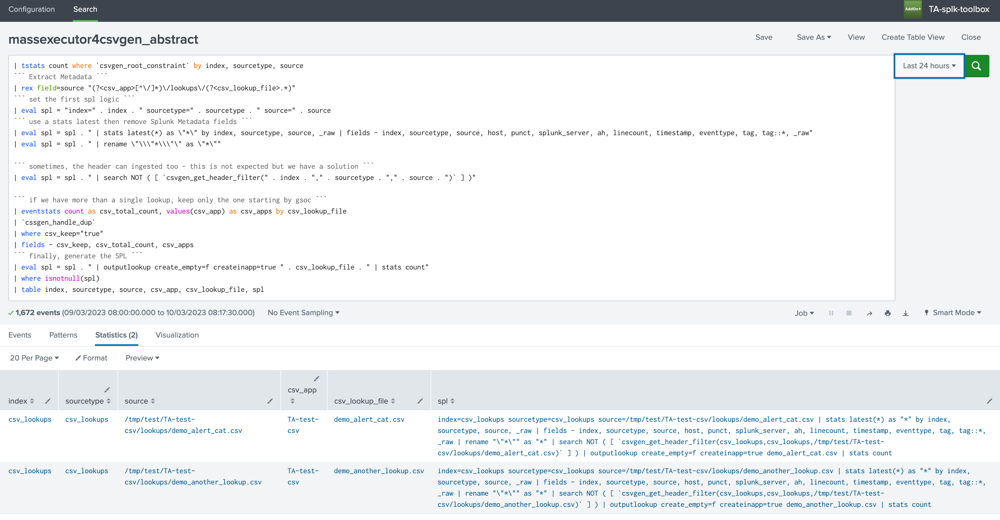
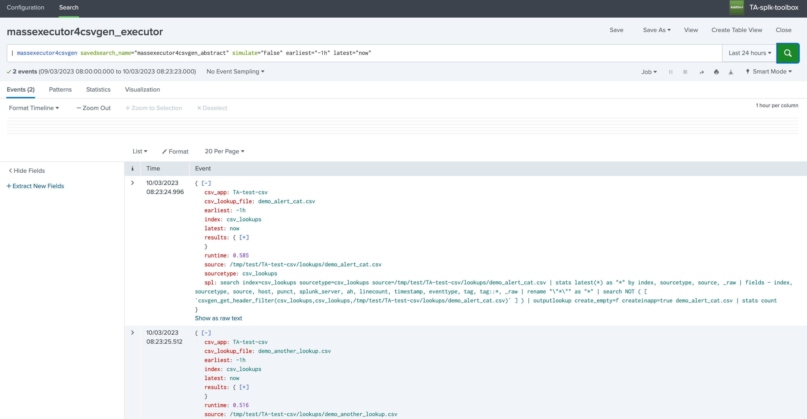
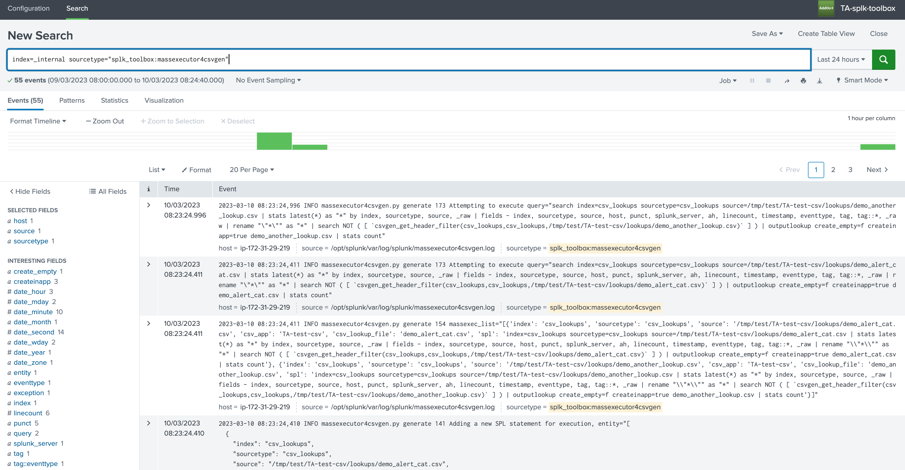

# TA-splk-toolbox - Toolbox application designed for Splunk Cloud operations

## Feature 1 - Exporting Splunk applications from Splunk Cloud

This application exposes a REST API for the purposes of exporting Splunk applications from a Splunk CLoud deployment.

### Concept

- An HTTP REST API interface exposes an endpoint that allows packaging and exporting a Splunk Application and all of its content
- Once packaged in the application working directory, the compressed tarball content is provided in a JSON payload over TLS encoded in base64
- The requester process process would read this base64 encoded JSON payload and decode the base64 using Python

### Requirements

- The only requirement is to have access to the Splunk Splunk Cloud Search Head Splunk API, which you can configure in Splunk Web
- Authentication is performed against Splunkd using valid credential you provide as part of the API requester arguments

### Important note

- This documentation details in depth all options and features you can use with this feature.
- Depending on your preferences, you totally can choose which part of the feature you want to use.
- For example, you don't necessarly need to export apps from Splunk Cloud in Splunk Cloud using the custom command (which requires connectivity from Cloud to HF), you can also interact with your HF instead. (which will interact with Cloud!)

#### Requirements for the couple TA-splk-toolbox / TA-splk-import-app

- The Splunk Cloud Search Head needs to be able to access to your Heavy Forwarder on Splunkd API 8089, for this you need to allow the outgoing traffic on ACS:

```shell
export stack="<my_stack>"
export token="<my_bearer_token>"

curl -X POST "https://admin.splunk.com/$stack/adminconfig/v2/access/outbound-ports" \
--header "Authorization: Bearer $token" \
--header 'Content-Type: application/json' \
--data-raw '{
   "outboundPorts": [{"subnets": ["<HF public IP>/32"], "port": 8089}],
   "reason": "external API splunkd"
}'
```

You can check your config as:

```shell
curl "https://admin.splunk.com/$stack/adminconfig/v2/access/outbound-ports/8089" \
--header "Authorization: Bearer $token"
```

Of course, your HF needs to accept the incoming traffic from Splunk Cloud.

- Then, the Heavy Forwarder itself needs to be able to do the opposite, this means accessing Splunk Cloud Search Head API on 8089.

You can nowadays allow this traffic straight from the Splunk Cloud configuration UI.

#### Example

**To export a Splunk Application and all its content in a gzip compressed tarball archived:**

```shell
export login='myuser'
export pass='mypassword'
export stack='https://$mystack.splunkcloud.com:8089'
```

**Then, you can call the export API endpoint:**

```shell
curl -k -u $login:"$pass" -X POST $stack/services/toolbox/v1/export/export_app -d '{"app": "Splunk_TA_juniper"}'
```

**The response will be similar to the following example:**

```json
{
  "base64": "b'H4sICP7sAmUC/0RBLUVTUy1zYW5kYm94X3YxMDAudGd6AO0ba3PbNtKf+StQZTKVcjZFUqIUZSS1bpJeO5fXWE6aTM6jgUhIQgMSLAFa0U1//O2ClETbcmzFrp1OCc+YeCwWC+wTDz07PHg+Gh0oGocT+bm591ckB1LX9/Hrdn23/F2lPbftO47vd1uQd9yW027vEX/vDlKmNE0J2VOJyOJPN5skTmT1/ZukZ2f5H7IpzYRu3gP/212n44IYdID/IAxuxf975D9NEjuQ8fTW+N/Jl2Yr/9uud47/kPH3iFPx/y9PH3kMCyDEiTXJuAjJgLhWUTVWMksDNg7mLPiksgjaGJu6vdBzPKcVeNTtgqXuOdR1Qr8VdNrTsOV1Ou0e7VnWx4yfWFyNT7niE8EMXkEnTEDurMwBrKBZDKOkJxbN9FymAHOc0uDTS0Ze8IhrFlohU0HKE81lfBHDKUtV3uDaju0AxgR60xkDEsKL4GZC46lMx1kSUs2UoW7vH5ku0X9FT1moGE1hrdRNLYHRf3Dol+h/t9Uu6z/4CQ/bK/2/i/SAXGS1ZT0ges4V0SmfzUC3rI/H85RRTQ7I26fAPPj+m8lZSpM5D8BSLMmvUZLKCUVNPwwCphSAHGUCFJAKlmo75DOm9DiSIZoCp6hVDDSX6yVUtVdVWZKk2H8DpdEUGBUNZBZrvUwQR5xFE5YSOSWAJNbKClIZjxVMIsyMvXnUdB3yKP+zQq4SqoO5DfMUHEnRPEKoAzfcNAo0BuumWC5Mk6BLe8ZillJhF4ODzGiuNA/UGiIBc2Pny2gX05xSpbe2azo5i4TFuHQjJN5M9I+MxjpfGMdKGdCVm7cZcgFmrec0hvo/MiDXzvh4NYMx+O2L9m4b4ClnC6TBEGTlHyj/STSSpQjY+4imsFIyFsuBTjNGgNFyMZYiHK8b84ZTKgB//RBsN3ACJAKptYGUBqGKIEnTVEYETC3FlRGDc5Bni2SyJOcAMsXS/fOVKg1IziqYUjxwFfmv9SdJYSmhqnYO+FENSanBB4FyiTHzDIM6IDKEwndsJAwpwCENbLE068ahm1fLVBOH/KsgAat4ImQxBaQNqxbg1BjhKpY6zoSoAyMb5PDVs3KVjBs5Rg3MjXKqFjwO5WLgkZkArRKDKRWKkZXs5miAYtCU0zEU9ktNiG7dJONSk6F004ilUutqFUwbFEpNT0ESN20BlMqNuChpuT2vKIGsJME0oziU1zdfIhyefDdYj94o+EQFgfm543RQx1mDLrdst+36Pa/jt/zHDdIk7mOnsY9QnoFarcnloCCBmgJkfbVGYKvMsl3eA9SUxgEb1Fs9vwdwNJAKECge13PysHNRAjIaDRCMeh2BNs1FKW/Oi4aSBqbSGCmsX1hfFfe9fCmmnIkQrWqOcDXhfaR85q4ypsZg3awf8hn0fjod8CnQ/L1h/PeAaS0FDTIAO9PYd/e3tgJxKmEsLCirr2nDBYO4HtdpPUhjRfCKr9iTDImPcGua1sgHIPVTzNQ3Mll7+OHgYXTwMCQPf3ny8OWTh6NaA3tq415yW2AEtBDhp0Ygn67EDgRsvyTFJVkvie9ZSV0J5oYLxZQNxYEUggWagE6yzwPQW0NHHhwPal/rGWtXeVkPvj+lmWbkZwkjkUOt0Q+e9aslD+rfmwedVx70ag+63X2S3OF80T9ucYg0wM9Wl1hyglta0c0Zwd3fjtI47DxnRH9Owc0J4ELdENogEuStQIF0lWBzhVeZEfKhQ2DpgH9cZCkbes7GaR4UlWVKV1UwepFVZ61egXafQIwOUhXvqphfVKYrVbEF32dcGQ6CfFFDC1OVLla6+G3qopDyU5YQg21sJiuANyuI12+P37w9hhh0vJLoTaS6qvpuUMPYvvbtq/aXlbP2Dz3X+crzH9zBiNu+BTKHPF84/y3f/3Q7Pp7/u+1Wdf5/b/xH69e8a/63O23Ye7VaHvDfr+7/7p3/GW/eH//bner+7/75j2GVat4R/9H+dxyv6+L9X8d1Kv5/I/wPWSTH7HMCEZ79ORK3f//r+v5Z/nsgAF51/3MXqf8DsJQUF6iDmms7tR+GVt9sqDSLEtxEDmq43VNN/D9ecD0fTwWd2XMdiRrBPeSgZvJDi0Dqm2ve4S8yYv1mnrf6RpSGVbj9d9R/2E6ZDfY4U2wcUMVAY3cyBFfof9vvdM/6f6/ldSv9vxv9D6maTyRNw7IRcEGv5ywCxQ5p+skodqHWICx4BE9QDghKxVrHASSVi8IGJDTO60zJHF2sSlDOD2g2FVD1R8bS5TDf7o95rFkaU4EHODxi+clHfjqT3/WFeN6Rnwag/ek38+5lhKujseGB157/OO831xVlqPyMbBhLMw99vllRsIDsCM9Rhm6/WS5uZtM8P52+zN+p4PnHoGao5/HMpp+5eoFrpd7bEf1dpqYw0kvBbDzKmQq5eClDVhsyIXiiuHolY5hbju1G6FOpzVlQbejshO+Ya8He2+YRDxdcL2vD4kHP7mg+3BIa78Z43tt0MknZKS/WJN51md/bCswkMErwGHi/U98PNx38w00G9248umfnx7vhrrIEPQvCeTzHg/Jr9zaZ2jCQIovi3XrZk2wCxL4EAqIsGvH/wfC+83U4eLzB4X4dDuz8E0gtTRndEQE+FniHDy1yEzGjidoRg5rLxTPw7LmR2JH3BQrBA/ZUCgGjQy2ewwJWgbJgO+6uyPAKJp9N8exsZwRLFCc15/Hy2l3DlAsRysWuwi/oUmYwZgJ2Z8TwxmAXBbjY2zYH1r+Cw0sY/Iv1hyMaz3bEymbQ1xZX+ZGXPAx3sJEF2sjgwPtwCALCXXvDziGACCIGxU35bH593qJZ+42Hel4beld10ilOUe1gklY9jCmCD4yK/dxr9zPqH7GQZ9H5Pv1mKdDpN9cxUL9pAqN+cx1rDb/t+P9WX39evf/3zPvP8vl/t9Oq4v87SR+fHv327AAYcmLlt4M2iygX+OTu1WiUTX7HWzi8xC1aF2wyl/JToXGlu8WLN9zOlovYPIgvLhtNsP8IQ3mTXb8O2mxEHLe6v7tT/Y+Yprd8+7PL7786jt/F8/92p1Wd/98r/4uIzMaK2+D/F97/Ox3v3Pt/t+u2nMr+34n9P7EgFmb4kxt1GhwoziIrf0IBNbBLCckT8pE8Iif7ZAF7NmaKNIx4vE8SuYCOJ1Z+N4AYlkpDf+vBgwfk+bvnr47J8Yc3z0eW9dG8asKjGrUF3MC/OXr9BiGTVCaXAh0fHb4a/fz66CVCgp+J1VSm0aXgL16//s9bgzV/EHMp4Ltfn/82Oj48fj56Yh5gkRjQgifCx6aKwBYnEyGZMGJeoWhJAvNyieTRozkGQ/fGFIy0KZxcvZCPtqzet6H/JhC8Fe2/Mv5znXbrnP3v+Hj/W+n/Heg/TZJm8YO/5iU//Dsp/cCuZ7u2Y8HWsHhW6HZ6XsdpuY89u/W453dx7ist2HpzcA2tuGBXcKO+NlOzCINKkNcvU+W2e67TatvdVtvFX5UjVWf2Nc1y5Hsdg3dTitqdx13Pc22v6z/ueeV1Kt2wnlzb+qpgXORMwB2x8a1R2XEd23O6vRayswrAq1SlKlWpSlWqUpWqVKUqValKVfq7p/8D8ZxjSQBQAAA='",
  "app": "Splunk_TA_juniper",
  "version": "1.5.5rfb1b492",
  "filename": "Splunk_TA_juniper_v155rfb1b492.tgz",
  "result": "The package is now ready in base64."
}
```

**More details about the programmatic behaviour can be found here:**

- https://github.com/guilhemmarchand/splunk-cloud-automation/tree/main/export-apps

This API response is what the TA-splk-import-app is going to handle, it will read the base64 accordingly and will re-create the provided package on the file-system.

### Configuration parameters

#### Configuration

The App provides a configuration UI with a concept of accounts, in each account you will setup:

- An account ID
- The URL to your Splunk Heavy Forwarder API
- A bearer token for the authentication purposes

**This will target a Heavy Forwarder instance running the TA-splk-import-app which contains the mirrored API endpoint and will perform the import from Splunk Cloud:**


**The workflow is the following:**

- From Splunk Cloud, a custom command is called to trigger the import on the target Splunk instance (HF)

- This custom command performs a REST call to the HF hosting the TA-splk-import-app

- In turn, the HF triggers a REST call back to Splunk Cloud, exports the app and runs the requested logic (merging, packaging and post-execution)

##### TA-splk-import-app

On the HF, the TA-splk-import-app is deployed, this app hosts a REST API endpoint which receives incoming REST calls via splunkd and a bearer authentication mechanism.

The configuration is similar to the TA-splk-import-app, with several additional parameters:

**Account:**


In this case, you want to configure Splunk Cloud as the target:

- An account ID
- The URL to your Splunk Cloud Search Head API
- A bearer token for the authentication purposes

**Main parameters:**

In addition, we have 3 main parameters:

- **The local target path**, which defines the location on the file-system of the Heavy Forwarder (the target) where application will exported and packaged, this directory needs to exist and be owned by the Unix user running Splunk processes

- The **ksconf finary path**, on the HF you need to install ksconf as a Splunk Application, see: https://ksconf.readthedocs.io

- An optional **post execution script**, this script would optionally be called at part of the build process to run your CI/CD logic, we will come back on this in the further steps!

## Simplified example of setup - interract with you HF

Once the Heavy Forwarder is connected to your Splunk Cloud stack, just do:

```shell
export target="https://localhost:8089"
export tokenhf="my bearer token on the HF"
```

Then you can export an app in one curl command:

```shell
curl -k -H "Authorization: Bearer $tokenhf" -H "Content-Type: application/json" -X POST $target/services/toolbox/v1/import/import_app -d '{"account": "scde", "app": "DA-ESS-sandbox", "run_build": "True"}'
```

To disable performing the build:

```shell
curl -k -H "Authorization: Bearer $tokenhf" -H "Content-Type: application/json" -X POST $target/services/toolbox/v1/import/import_app -d '{"account": "scde", "app": "DA-ESS-sandbox", "run_build": "False"}'
```

To specify large files exclusions options:

```shell
curl -k -H "Authorization: Bearer $tokenhf" -H "Content-Type: application/json" -X POST $target/services/toolbox/v1/import/import_app -d '{"account": "scde", "app": "DA-ESS-sandbox", "run_build": "False", "exclude_large_files": "True", "large_file_size": 100}'
```

You will receive a response such as:

```json
{
  "action": "success",
  "account": "scde",
  "url": "https://scde-3omlxvajzn05de2xk.splunkcloud.com:8089",
  "run_build": true,
  "promote_permissions": false,
  "exclude_large_files": true,
  "large_file_size": 100,
  "excluded_files": [
    {
      "path": "/opt/splunk/etc/apps/DA-ESS-sandbox/lookups/crazy_large.csv",
      "size_mb": 275.029
    }
  ],
  "post_execution": false
}
```

On the Heavy Forwarder file-system:

```shell
ls -ltr /download/scde/
total 732
drwx--x--- 5 splunk splunk   4096 Mar 20 20:31 DA-ESS-sandbox
-rw------- 1 splunk splunk 742212 Mar 20 20:31 DA-ESS-sandbox_v100.tgz
```

## Run time and toolboxexport custom command

The magic happens from Splunk Cloud, a custom command called `toolboxexport` perfoms a transaprent integration in SPL, both application provide now a bi-directional integration we are going to leverage.

### Testing endpoints

The TA-splk-import-app as well as the TA-splk-toolbox provide testing endpoints which can be used to validate the network connecttivity, as well as the authentication for both traffics. (yes!)

#### Testing the configuration, network and authentication from Splunk Cloud to our Heavy Forwarder

**In Splunk Cloud, run the following SPL command:**

_Replace the account accordingly, this is the account ID you configured in Splunk Cloud:_

```shell
| toolboxexport account="lab" mode="test"
```


Note that the API is very polite. (this is not always the case)

**This validates that:**

- The Splunk Cloud Search Head can communicate with your Heavy Forwarder splunkd API from a network perspective
- The authentication on the Heavy Forwarder is successful
- The REST API endpoint is behaviaving properly, and ready to server requests

#### Testing the bi-directional configuration, network and authentication from Splunk Cloud to our Heavy Forwarder, our Heavy Forwarder back to Splunk Cloud

**In Splunk Cloud, run the following SPL command:**

_Replace the account accordingly, this is the account ID you configured in Splunk Cloud, the remote_account is the account ID you configured in your Heavy Forwarder:_

```shell
| toolboxexport account="lab" mode="sc_test" remote_account="scde"
```


**This validates that:**

- The Splunk Cloud Search Head can communicate with your Heavy Forwarder splunkd API from a network perspective
- The authentication on the Heavy Forwarder is successful
- The REST API endpoint is behaviaving properly, and ready to server requests (import API)
- The Heavy Forwarder can communicate with the Splunk Cloud Search Head (export API), communication and authentication from the Heavy Forwarder to Splunk Cloud is successful.

It's a kind of magic. (Surely you head the music too)

### Exporting a Splunk Cloud application by triggering the action in SPL on Splunk Cloud

**Let's get serious now, the following first example:**

```shell
| toolboxexport account="lab" mode="live" remote_account="scde" app="TA-org-customapp"
```


**This Will:**

- Calls the import API on the HF
- The HF in return calls the export API on Splunk Cloud
- It receives the Application export
- It merges local objects using ksconf, and produces a final package, on the file-system we have the extracted directories as well as the archive ready to be used

**Let's check the file-system:**


Very nice, now let's get with some more details about the options, we can for instance avoid running the build process to review what the local objects are:

```shell
| toolboxexport account="lab" mode="live" remote_account="scde" app="TA-org-customapp" run_build="False"
```


Reviewing the file-system, we can see our local objects!


You can control whether you want to promote permisions or not, using:

```shell
promote_permissions="True"
```

The default is False.

#### Post execution

Ok, the magic isn't over! Very likely, you need to run an additional logic from here, whatever that logic is, and of course you need flexibility and control.

You can now call the `post execution script` automatically (on the Heavy Forwarder) as long as it has been configured on the UI (on the Heavy Forwarder), and you submitted a post exec Metadata object.

_Example:_

```shell
| toolboxexport account="lab" mode="live" remote_account="scde" app="TA-org-customapp" run_build="False" postexec_metadata="{\"user\": \"foobar\", \"branch\": \"main\", \"commit_message\": \"Because I deserve it.\""}
```


Consider the following Python script example:

```python
#!/usr/bin/env python
# coding=utf-8

from __future__ import absolute_import, division, print_function, unicode_literals

__author__ = "Guilhem Marchand"

import os, sys
import json
import logging
import argparse
import configparser
from urllib.parse import urlparse

# Args
parser = argparse.ArgumentParser()
parser.add_argument("--session_key", dest="session_key")
parser.add_argument("--server_rest_uri", dest="server_rest_uri")
parser.add_argument('--file', dest='file')
parser.add_argument('--metadata', dest='metadata')
args = parser.parse_args()

# get session_key
if args.session_key:
    session_key = args.session_key
else:
    logging.error("session_key argument was not provided, this is mandatory")
    sys.exit(1)

# get server_rest_uri
if args.server_rest_uri:
    server_rest_uri = args.server_rest_uri
else:
    logging.error("server_rest_uri argument was not provided, this is mandatory")
    sys.exit(1)

# extract rest host and port
parsed_uri = urlparse(server_rest_uri)
server_rest_host = parsed_uri.hostname
server_rest_port = parsed_uri.port

# Set file
if args.file:
    file = args.file
else:
    logging.error("file argument was not provided, this is mandatory")
    sys.exit(1)

# Set metadata
if args.metadata:
    metadata = args.metadata
else:
    logging.error("metadata argument was not provided, this is mandatory")
    sys.exit(1)

# process

metadata = json.loads(metadata)

requester_user = metadata.get('user')
requester_branch = metadata.get('branch')
requester_commit_message = metadata.get('commit_message')

print('received file=\"{}\", metadata=\"{}\"'.format(file, json.dumps(metadata, indent=2)))
print('request from user=\"{}\"'.format(requester_user))
print('request for branch=\"{}\"'.format(requester_branch))
print('request for commit_message=\"{}\"'.format(requester_commit_message))
```

The Metadata post exec object can be anything, the smarter design would be to send a JSON object, which can then be loaded transparently as a proper object in Python, allowing all flexibility for the rest of your steps.

You can add whatever makes sense for you, with the flexibiity of SPL, Javascript, Python and so forth.

If some technical issues happen during the execution of the post exec script, this will noticed by the REST API which will return an action failure, as well as 500 HTTP code.

**Voila!**

#### Available options summary

```json
{
    "account": "The account configuration identifier",
    "app": "The application to be exported",
    "run_build": "Run the building package, which means merging local configuration using ksconf, valid options are: True | False",
    "promote_permissions": "If run_build=True, you can decide to promote or not the local permissions, default to False, valid options are: True | False",
    "postexec_metadata": "Metadata for the post execution script, this should be a JSON object",
    "exclude_large_files": "Exclude large files from the export, True or False. Defaults to True",
    "large_file_size": "The size in MB to consider a file as large. Defaults to 100MB"
}
```

## Feature 2 - Ingesting CSV lookups and mass executor generator

In Splunk Cloud, you cannot update lookups by publishing an application if these lookups exist already, unlike the normal Splunk behaviour, this means:

- At first deployment of an app containing lookups, the content of the lookups is the one expected as per your application
- If a user modifies a lookup in Splunk Web, the change applies to the lookups/mylookup.csv as expected and is replicated automatically amongst the SHC members (if in SHC)
- However, publishing a new release of your app will NOT override the content of the lookup
- This means that once a lookup has been published in Splunk Cloud, you loose control on it from a deployment perspective

The logic is this tooling is to ingest the CSV lookup by monitoring these using a UF / HF and a file monitor, if the lookup is updated, Splunk notices it and indexes its content in a CSV indexed manner.

By relying on the source structure, we extract the Metadata information such as the app context, then a scheduled logic generates the SPL statements and a Python based mass executor executes the SPL statements sequentially to perform an outputlookup call accordingly.

### Ingest CSV lookups

#### Limitations

If there are conflicting fields in the lookups regarding Splunk indexed metadata fields, for instance if the lookup has a field named sourcetype, Splunk will automatically prefix these fields with `extracted_` when these are indexed.

Therefore, the logic manages this automatically such that you can any of these conflicting fields as part of the lookups, without having this representing an issue.

However, this means none of the lookup can have field names starting with `extracted_*`, these would be ignored.

#### Ingest

**Say you have the following directory structure:**

```shell
/opt/github/myapp1/lookups/
                            mylookup1.csv
                            mylookup2.csv

/opt/github/myapp2/lookups/
                            mylookup3.csv
                            mylookup4.csv
```

##### Define a file monitor with the following props.conf: (checkout the source stanza here, this needs to match your context)

```shell
# CSV ingest
[csv_lookups]
FIELD_DELIMITER=,
FIELD_QUOTE="
HEADER_FIELD_LINE_NUMBER=0
INDEXED_EXTRACTIONS=csv
SHOULD_LINEMERGE=false
# Set timestamp now
DATETIME_CONFIG = CURRENT
# Do not allow KV_MODE exactions
KV_MODE=none
# Punct is very usefull here
ANNOTATE_PUNCT=false

# use an INGEST_EVAL to create a unique md5 for each record, we will use this information as part of the break by statement
TRANSFORMS-set-md5 = set-csvrecord-md5

# This should match all CSV lookup files we ingest
[source::/opt/github/.../*.csv]
CHECK_METHOD = entire_md5
```

Create the associated transforms.conf stanza:

```shell
[set-csvrecord-md5]
INGEST_EVAL = record_md5=md5(_raw)
```

Then, define an inputs.conf: (update the index name if you wish to do so)

```shell
# ingest for Git repos with the old structure, where the lookup directory is the root of the repository
[monitor:///opt/github/*/lookups/*.csv]
index = csv_lookups
sourcetype = csv_lookups
# source: we want the automatic source
crcSalt = <SOURCE>
```

### Run the logic

**BEFORE you start running the logic, the corresponding application should be deployed in Splunk Cloud.**

This is because the capabilities of the outputlookup command are limited, it will override the good lookup in the right app namespace file ONLY if it defined already.

If you have more than once the same named lookup in different app namespaces, then you cannot know really which app namespace will receive the update, you should avoid this use case.

### Run time

**First, make sure you deployed the TA-splk-toolbox application in Splunk Cloud.**

**Then, Check the reports in the app, there are two reports:**

- massexecutor4csvgen_abstract

- massexecutor4csvgen_executor

You need to enable both searches. (these are disabled by default)

**If you changed the index target, you need to update the following macro:**

- csvgen_root_constraint

**First do a manual run of the abstract report, this will generate a list of spl statement assuming you have indexed data already:**



These statement are the ones the custom command is going to magically execute.

**Now, run the massexecutor:**



The Python tool executes the statement and shows the results, its activity is looged in:

```shell
index=_internal sourcetype="splk_toolbox:massexecutor4csvgen"
```


